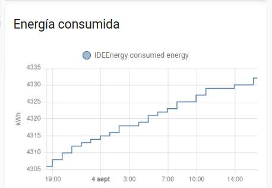
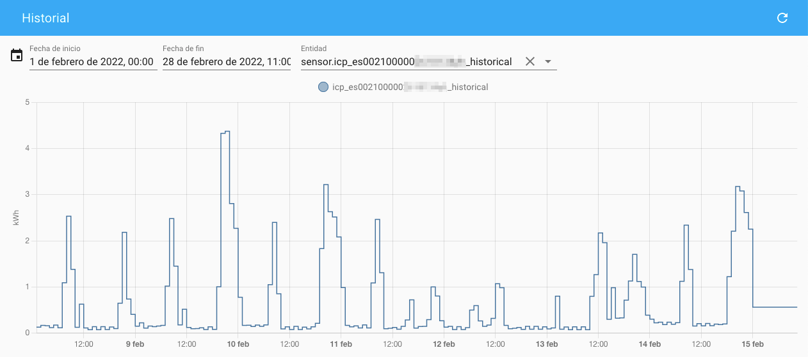
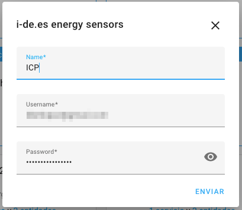
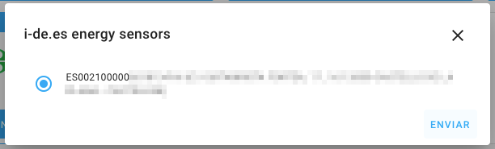

# i-DE (Iberdrola Distribución) Custom Integration for Home Assistant

<!-- Home Assistant badges -->

<!-- Code and releases -->

[ideenergy](https://github.com/ldotlopez/ideenergy) integration for [home-assistant](https://home-assistant.io/)

Esta integración provee sensores para el distribuidor de energía español [i-DE](i-de.es).

Require de un usuario **avanzado** en la página web del distribuidor.

**⚠️ Asegurese de leer la [FAQ](https://github.com/ldotlopez/ha-ideenergy/blob/main/FAQ.md)' y las secciones 'advertencias' y 'dependencias'.**

## Características

* Integración con el panel del energía de Home Assistant

* Sensores de consumo instantaneo y acumulado.

* Sensores históricos (consumulo y generación solar) con mayor precisión (sub-kWh). Estos datos no son tiempo real y normalmente llevan un retraso de entre 24 y 48 horas.

* Soporte para varios contratos (puntos de servicio).

* Configuración a través del [interfaz web de Home Assistant](https://developers.home-assistant.io/docs/config_entries_options_flow_handler) sin necesidad de editar ficheros YAML.

* Algoritmo de actualización para leer el contador cerca del final de cada periodo horario (entre el minuto 50 y 59) y una mejor representación del consumo en el panel de energía de Home Assistant

* Totalmente [asíncrono](https://developers.home-assistant.io/docs/asyncio_index) e integrado en Home Assistant.

## Dependencies

Es necesario disponer de acceso al área de clientes de i-DE.
Puedes registrarte en el siguiente link: [Área Clientes | I-DE - Grupo Iberdrola](https://www.i-de.es/consumidores/web/guest/login).

Además es necesario disponer del perfil de "Usuario avanzado". Si no se dispone de él hay que rellenar un formulario del [Perfil de cliente](https://www.i-de.es/consumidores/web/home/personal-area/userData).

### Usando [HACS](https://hacs.xyz/) (recomendado)

1. Copia la dirección de este repositorio: (https://github.com/ldotlopez/ha-ideenergy)[https://github.com/ldotlopez/ha-ideenergy/]

2. Añade este repositorio en HACS como "repositorio manual":

  - En el campo "Repositorio" pega la URL anterior.
  - En el campo "Categoría" elige "Integración"
  - Pulsa el botón "Descargar" y elige la última versión.

  

3. Reinicia Home Assistant

4. Configura la integración

  - (Opción A) Pulsa el botón "Añadir integración" → 

  - (Opción B) Navega a "Ajustes" → "Dispositivos y servicios" y pulsa "Añadir integración". Elige "i-DE.es sensores de energía".  
    

5. Sigue los pasos del asistente: Proporciona tus credenciales de acceso para el área de cliente de "i-DE", después elige el contrato qu deseas monitorizar. Si necesitas añadir más contratos repite los pasos anteriores para cada uno de ellos.

## Instalación

A través de custom_components o [HACS](https://hacs.xyz/)

1. Descarga o clona este repositorio: [https://github.com/ldotlopez/ha-ideenergy](https://github.com/ldotlopez/ha-ideenergy)

2. Copia la carpeta [custom_components/ide](custom_components/ideenergy) en tu carpeta `custom_components` de tu instalación de Home Assistant.

3. Reinicia Home Assistant
4. Configura la integración

  - (Opción A) Pulsa el botón "Añadir integración" → 

  - (Opción B) Navega a "Ajustes" → "Dispositivos y servicios" y pulsa "Añadir integración". Elige "i-DE.es sensores de energía".  
    

5. Sigue los pasos del asistente: Proporciona tus credenciales de acceso para el área de cliente de "i-DE", después elige el contrato qu deseas monitorizar. Si necesitas añadir más contratos repite los pasos anteriores para cada uno de ellos.

## Capturas

*Sensor de energía acumulada*

*Sensor de histórico de energía*

*Asistente de configuración*

## Advertencias
Esta integración provee un sensor 'histórico' que incorpora datos del pasado en la base de datos de Home Assistant. Por su propia seguridad este sensor no está habilitado y debe activarse manualmente.

☠️ El sensor histórico está basado en un **hack extremadamente experimental** y puede romper y/o corromper su base de datos y/o estadísticas. **Use lo bajo su propio riesgo**.